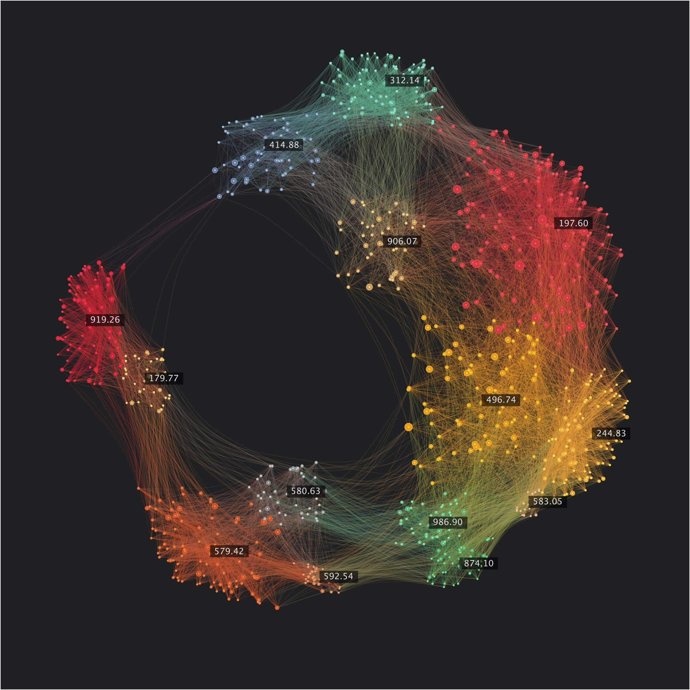
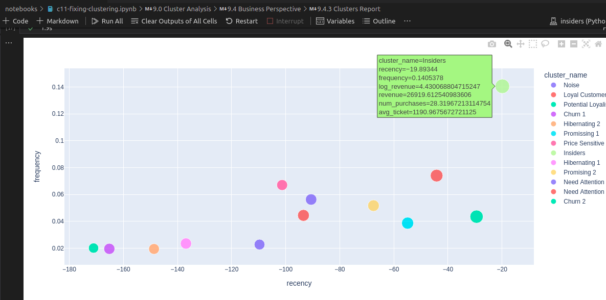
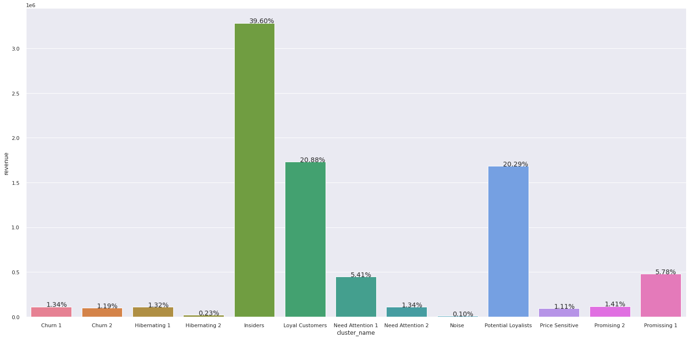
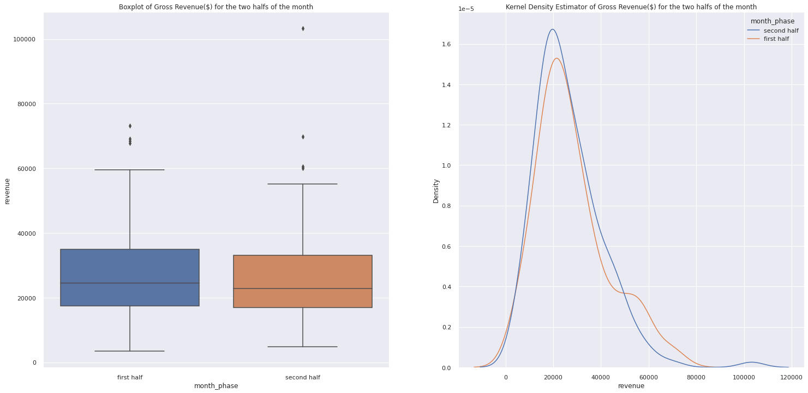
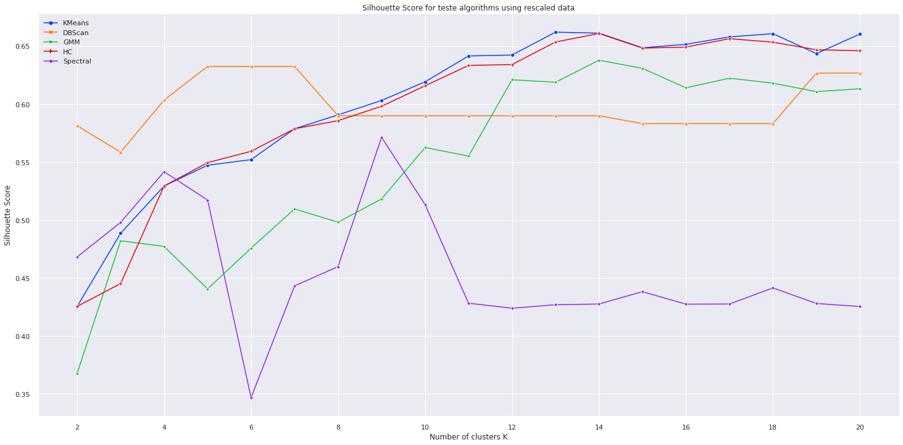
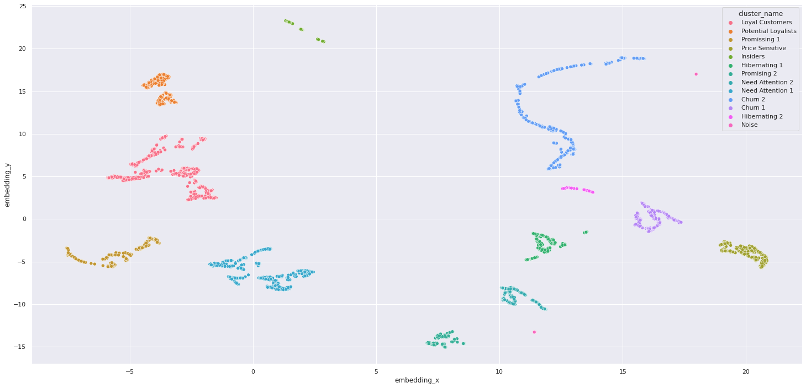

## Cluster_Customer

-----

## Project Overview 🎯
**Main objetive:** 
- Select potential customers for a loyalty program 

**Why?** 
[According to the Harvard Business Interview](https://hbr.org/1995/05/do-rewards-really-create-loyalty), customer loyalty program increases profits, improves sales success and allows for sustainable growth. A well-designed and well-executed loyalty programme can help a company retain existing customers, attract new customers, reduce turnover and drive profits.

**Related Opportunities:** 
- Find potential customer clusters to understand customer spending habits better.
- Generate "Business Levers" for each cluster if possible.
- Find insights about customers' spending habits

If you would wish, you may interact with the public view of the dashboard i designed in the deployment stage. Just click on the thumbnail:

## How was this solution developed? ✔
### Each step has a detailed notebook with explanations, just click on the links below

**1. Data Description & Data Filtering: :** Exploring the raw data, formatting it into a usable data frame and removing inconsistencies found in data

**2. Feature Engineering & EDA :** Trying to generate features based on business knowledge. Exploring data to find correlations and verify data distributions. Also testing several embedding methodologies

**3. Data Preparation & Feature Selection:** Applying feature rescaling and encodings. Selecting most important features.

**4. Model Testing & Model Training :** Testing several clustering algorithms and evaluating their performance. Finding best hyperparameters for the selected model.

**5. Cluster Analysis & Convert Model Performance to Business Values:** Analyzing clusters found and their silhouette.  Evaluating hypotheses about business, possible business questions, describing clusters formed, and defining simple business levers

## Business Results

To simplify the visualization of the results I generated an interactive plot using Plotly's scatter function (only generated if you run the cells of the notebook)

These are some simple business levers I would suggest to the company:

| Cluster | Name | Action Plan  |
|-|-|-|
| 4 | **Insiders** | **Keep engaged, offer concierge**  |
| 1 | Potential Loyalists | Increase purchase frequency  |
| 0 | Loyal Customers | Increase average ticket  |
| 2 | Promissing 1 | Increase frequency  |
| 8 | Need Attention 1 | Decrease recency  |
| 6 | Promising 2 | Increase avg ticket  |
| 7 | Need Attention 2 | Increase avg ticket |
| 5 | Hibernating 1| Make them buy again |
| 10 | Churn 1 |Make them buy again |
| 3 | Price Sensitive | Increase avg ticket, Show more promos |
| -1 | Noise | Ignore |
| 9 | Churn 2 | Do nothing |

## Some Interesting Data Insights

**Customers from Insiders Program are responsible for 40% of revenue (H4)**

**Customers buy 10% more on the first half of the month (H3)**
**False** There is no significant difference between gross revenue in the first and second halves of the month

I executed some statistical tests to confirm this: Mann-Whitney U test for difference of medians (since data does not follow a normal distribution). The test yielded a p-value of 0.44, therefore we do not reject the null hypothesis of equality of medians (we would have a 44% chance of being wrong rejecting H0)

## Machine Learning Model Performance

Silhouette Coefficient for the tested models:

An image of the embedding space and clusters found in the Tree Embedded and UMAP reduced data:

## Key lessons learned 🤓
- Clustering is a very challenging machine learning application (much more than I thought) since there is no "right answer".
- Tree algorithms are awesome! In this project, they were used for embedding purposes and outperformed several complex manifold algorithms alone.
- Be very careful using manifold learning specially UMAP, any small changes to the data may result in a significant change in the results obtained.

## Next Steps to Improve
- Attempt to generate more insights using basket analysis methodologies.
- Implement a more complete CI/CD solution to automatically pull changes from GitHub into the EC2 instance (Github Actions, Jenkins, or Airflow).
- Apply a moving average such as ARIMA or SARIMA model to forecast each cluster revenue.
- Develop and deploy another more interactive dashboard or app to explore clusters.

### References
- Got some metrics from [shopify](https://www.shopify.com/enterprise/ecommerce-returns)  and [leanexperimentation blog](
https://leanexperimentation.com/optimizing-an-e-commerce-with-15-key-metrics/)

- [RMF Analysis](https://clevertap.com/blog/rfm-analysis/)
https://clevertap.com/blog/rfm-analysis/

- [Mann-Whitney](http://www.inf.ufsc.br/~vera.carmo/Testes_de_Hipoteses/Testes_nao_parametricos_Mann-Whitney.pdf)

- permutation_test: [Github guide](https://rasbt.github.io/mlxtend/user_guide/evaluate/permutation_test/) and [rcompaniong.org](https://rcompanion.org/handbook/F_15.html#:~:text=Permutation%20tests%20can%20be%20used,can%20compare%20only%20two%20groups.)

